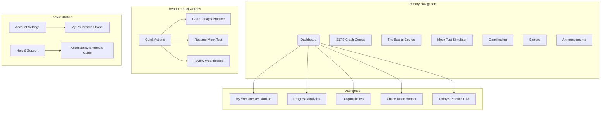

## **ShikhiLAB AI-Powered IELTS Platform: UI/UX Specification (Definitive Final Version)**

### **Step 1 of 11: Overall UX Goals & Principles**

### **1. Overall UX Goals & Principles (Final v2)**

**Target User Persona**
*   **Primary MVP Persona: The Ambitious Achiever:** A highly motivated **Bangladeshi** IELTS candidate who needs an authentic, efficient, and supportive environment to achieve a high band score. They value clear goals, measurable progress, cultural relevance, and mobile access.

**Usability Goals**
1.  **Authentic Simulation**
    *   Achieve **≥95%** user confidence that the mock test simulator replicates official IELTS format, timing (±2 s), and question behavior.
    *   Validate through comparative user testing with students who have taken both the simulator and the real exam.
2.  **Motivational Progression**
    *   Provide a clear, actionable progress overview: course completion %, evolving skill levels, and personalized “My Weaknesses” links.
    *   Maintain **≥80%** daily engagement rate via gamified streaks and achievements.
3.  **Effortless Onboarding**
    *   **85%** of new users complete the diagnostic test and understand their personalized dashboard within 15 minutes, with **<5%** abandonment.
    *   Validate via moderated usability tests on representative Bangladeshi students.
4.  **Inclusive & Accessible**
    *   Fully conform to **all 50 WCAG 2.1 Level A/AA success criteria**, including mobile-specific criteria (orientation flexibility, reflow, non-text contrast), keyboard operability, error prevention, and robust ARIA support.
    *   Validate via automated audits (e.g., axe), manual checks, and assistive technology testing.
5.  **Cultural Sensitivity**
    *   Incorporate Bangladeshi-context examples in micro-lessons and scenarios.
    *   Offer collaborative practice options and support for local learning styles.
6.  **Mobile-First Learning**
    *   Optimize for mobile devices: thumb-friendly interaction zones, bottom tab bar navigation, offline capability, and efficient data usage.
    *   Ensure full feature parity across desktop and mobile.

**Design Principles**
1.  **Authenticity First:** Prioritize faithful replication of the IELTS experience over aesthetic embellishment.
2.  **Clarity & Focus:** Employ minimalist layouts and progressive disclosure to reduce extraneous cognitive load.
3.  **Privacy-by-Design:** Gamification and social features default to **private participation** with granular, opt-in consent and clear data usage explanations.
4.  **Supportive Feedback:** Frame all AI and system feedback in an encouraging tone. Errors become *learning opportunities* with guided correction.
5.  **Build Trust Through Transparency:** Expose AI feedback rationale and scoring calculations in plain language.
6.  **Cognitive Load Optimization:** Structure content hierarchies and micro-interactions to align with proven educational UX patterns.
7.  **Cultural Sensitivity:** Use culturally-neutral iconography and local idioms; surface collaborative options for communal learning preferences.
8.  **Mobile-First Learning:** Design all interactions for on-the-go usage, with offline-first capabilities and smart notifications respecting daily routines.
9.  **Accessibility-Native Design:** Embed WCAG 2.1 AA requirements from the outset, using ARIA landmarks, a keyboard shortcuts guide, and adequate color contrast.

**Measurable Success Criteria**
*   **Authenticity:** ≥95% simulator fidelity rating.
*   **Onboarding:** ≥85% completion within 15 min, <5% abandonment.
*   **Accessibility:** 100% WCAG 2.1 AA compliance.
*   **Engagement:** ≥80% average daily active users.
*   **Cultural Fit:** Positive qualitative feedback on local relevance.
*   **Privacy:** ≥90% user understanding in consent flow.

**Validation Methods**
*   Comparative user testing vs. real IELTS takers.
*   Automated + manual WCAG audits.
*   Moderated and unmoderated usability tests with Bangladeshi candidates.
*   A/B testing for key UX and gamification elements.
*   Real-world context testing across network conditions and devices.

***

### **2. Information Architecture (Final v2)**

**Core Goal:** To create a clear, predictable, and scalable structure that empowers users to navigate the platform with confidence and minimal cognitive load.

**Site Map / Screen Inventory**
This diagram provides a comprehensive overview of the platform's primary screens and their relationships, including all finalized modules.

**Navigation Structure**

*   **Primary Navigation (Desktop):** A persistent sidebar provides direct access to: Dashboard, IELTS Crash Course, "The Basics" Course, Mock Test Simulator, Gamification, Explore, and Announcements.
*   **Primary Navigation (Mobile):** A **Bottom Tab Bar** provides ergonomic access to the most critical modules (e.g., Dashboard, Practice, Tests).
*   **Quick Actions (Header):** A persistent menu in the header provides shortcuts to the user's most likely next actions: "Go to Today's Practice," "Resume Mock Test," and "Review Weaknesses."
*   **Dashboard Intelligence:** The Dashboard is dynamic. It features a conditional **"Today's Practice" CTA** (for users enrolled in The Basics) and an **Offline Mode Banner** (when the PWA is installed and connectivity is lost).
*   **Utilities (Footer/Off-Canvas):** A consistent secondary location provides access to Account Settings (containing the **My Preferences Panel**) and Help & Support (containing the **Accessibility Shortcuts Guide**).

**Key Anxiety-Reducing Features of this IA:**
*   **Predictability & Consistency:** The structure is logical and familiar, reducing cognitive load.
*   **Efficiency:** "Quick Actions" and intelligent Dashboard CTAs minimize clicks for core tasks.
*   **Empowerment:** The "My Preferences Panel" gives users direct control over their experience.
*   **Scalability:** The "Explore" and "Announcements" sections provide a clear home for future growth without cluttering the core experience.

***

### **3. Core User Flows (Final v2)**

#### **Flow 1: First-Time User Onboarding**

*   **Core Goal:** To create a comprehensive, multi-step flow that creates an empowering first impression.
*   **Key Stages:** The journey begins with a trust-building **Privacy Consent** screen and a value-driven **Notification Permission** request. It then moves to a tailored **Goal Setting** screen, a low-stress **Diagnostic Test** with aggressive auto-saving, and concludes with a **strengths-first Results page** that provides a clear, actionable next step. This entire flow is designed to be personalized, culturally aware, resilient, and deeply aligned with our core principle of reducing user anxiety.

#### **Flow 2: "The Basics" Daily Practice Loop**

*   **Core Goal:** To create the core habit-forming engine of the platform.
*   **Key Features:** This flow is designed around a personalized, **swipeable card-based "daily workout"** that is adaptive, culturally aware, and includes empathetic features. To prevent user frustration, the interface includes a simple **'Back' button**, allowing users to easily navigate between exercise cards and mitigating the risk of accidental swipes. The system is designed to be supportive, with features like **flexible streaks** (e.g., practicing 4 out of 7 days) and proactive **frustration prevention** (offering an easier variant if a user struggles).

#### **Flow 3: IELTS Practice & AI Feedback Loop**

*   **Core Goal:** To create an empowering improvement engine where users can confidently act on their identified weaknesses.
*   **Key Features:** This flow is designed as a closed-loop system. The user moves from their **"My Weaknesses"** module to a targeted practice exercise. They receive detailed, culturally relevant AI feedback on a dedicated, **strengths-first review page** designed to be empowering, not judgmental. The system includes robust **AI quality assurance** mechanisms, such as confidence scoring, to build user trust in the feedback. The entire experience is designed to transform errors into clear, actionable learning opportunities.

#### **Flow 4: The Mock Test Simulator**

*   **Core Goal:** To provide a high-stakes, confidence-building experience that prioritizes psychological safety and technical resilience.
*   **Key Features:** The design is **large-screen-first** to guarantee authenticity, with a **fully re-flowed, mobile-optimized adaptation** that adheres to our strict accessibility and ergonomic patterns. The flow includes an **"Untimed Practice Mode"** to reduce anxiety, **aggressive local auto-saving** to prevent data loss, and an empowering results analysis that transforms scores into a clear, actionable study plan. It is a technically resilient and psychologically safe environment for users to measure their progress.

#### **The Virtuous Cycle:**
These flows are designed to work together in a powerful, self-reinforcing loop. The **Mock Test** (Flow 4) provides the most accurate data for the **"My Weaknesses"** module. This data, in turn, powers the targeted **AI Feedback Loop** (Flow 3) and personalizes the **Daily Practice Loop** (Flow 2). Consistent daily practice builds the skills and confidence needed to succeed in the next mock test, completing the virtuous cycle of learning and improvement.

***

### **4. Comprehensive Wireframe Package (Final v2 - Detailed Version)**

**Core Goal:** To provide a complete visual and structural blueprint for the entire platform, meticulously applying our foundational pattern systems to bring our world-class user flows to life.

#### **Part 4.1: Foundational Pattern Systems (The DNA of Our Design)**

These two systems are the non-negotiable rules that govern our entire user interface.

##### **Pattern System 1: Mobile-First & PWA (Final v2)**
*   **Core Goal:** To create a seamless, native-feeling, and reliable experience on mobile devices that respects user ergonomics, conserves resources, and builds trust through transparent state communication.
*   **Layout & Ergonomics:**
    *   **Thumb Zone Optimization:** Primary actions are placed in the bottom 25-33% of the screen.
    *   **Implementation Specifications:** Minimum touch targets of **48px** for primary buttons and **44px** for secondary links, with at least **8px** of spacing between them.
*   **Interaction & Feedback System:**
    *   **Contextual Gestures:** `Swipe` for navigation, `Pull-to-Refresh` for updates, `Long Press` for context menus.
    *   **Differentiated Haptics:** Light impact for success, medium for achievements, gentle tap for errors.
*   **PWA & Offline Experience:**
    *   **Smart Installation:** "Add to Home Screen" prompt is triggered after sustained user engagement.
    *   **Culturally Sensitive Push Notifications:** Permission is requested contextually, and timing is aware of local holidays and prayer times.
*   **Cross-Platform Consistency:** The system accounts for native iOS (back-swipe) and Android (Material gesture) patterns.

##### **Pattern System 2: Accessibility-Native Patterns (WCAG 2.1 AA) (Final v2)**
*   **Core Goal:** To embed inclusivity into the fabric of our platform, ensuring all users have an equivalent and empowering learning experience.
*   **Screen Reader & Semantic Structure:**
    *   **ARIA Landmarks:** Every screen is programmatically structured with `<nav>`, `<main>`, `<header>`, etc.
    *   **Logical Heading Hierarchy:** Every page has exactly one `<h1>` and a logical, non-skipping heading structure.
*   **Keyboard Navigation:**
    *   **Logical Tab Order:** A predictable focus order is maintained on all screens.
    *   **Visible Focus Indicators:** All interactive elements have a clear, high-contrast focus ring.
    *   **Focus Traps:** Modals and off-canvas menus trap keyboard focus until dismissed.
*   **Visual & Cognitive Accessibility:**
    *   **High Contrast Mode:** A high-contrast theme is available.
    *   **Dynamic Type Scaling:** The UI respects system-level font size settings.
    *   **Information Through More Than Color:** All status information is conveyed using a combination of color, icons, and text.

#### **Part 4.2: Comprehensive Wireframe Package: The Core Flows**

This package includes the detailed, high-fidelity wireframes for all critical screens and states.

**1. The Onboarding Flow (Finalized)**
*   **Critical Missing Screen 1: Privacy & Consent (Final v2):** A full-screen, trust-building interface with granular toggles for "AI Feedback," "Offline Storage," "Progress Analytics," and "Leaderboard" (opt-in by default). It includes clear explanations and cultural context.
*   **Critical Missing Screen 2: Notification Permission Request (Final v2):** A value-driven "soft prompt" that explains the benefits of notifications ("Students with reminders improve 23% faster") and provides granular toggles for different notification types.
*   **Screen 1: The Welcome Modal:** A culturally-aware welcome screen that tailors the onboarding journey based on the user's self-identified experience level ("I'm new to IELTS").
*   **Screen 2: Goal Setting:** A tactile, mobile-friendly screen with sliders and date pickers for setting goals, including a culturally-sensitive "Adjust for Ramadan" toggle.
*   **Screen 3: The Diagnostic Test Interface:** A low-stress environment with a clear progress bar, estimated time remaining, and persistent "Save & Exit" and "Skip for Now" options to reduce anxiety.
*   **Screen 4: Results & Handoff to Dashboard:** An empowering results screen that leads with a **strengths-first** visual hierarchy and provides a single, clear CTA to the user's personalized dashboard.

**2. The Dashboard (The Personal Hub) (Finalized)**
*   A hyper-personalized and motivating home screen.
*   **Key Features:**
    *   A dynamic, **state-aware primary CTA** (e.g., "Start Today's Practice," "Continue Diagnostic").
    *   AI-powered recommendations: "Recommended: 15 min focus on Grammar."
    *   Visual, **skill-specific progress bars** and a prominent **Achievement Showcase**.
    *   A culturally-aware greeting (e.g., "Assalamu Alaikum!").

**3. "The Basics" - Today's Practice Screen (The Habit Engine) (Finalized)**
*   An intelligent, adaptive, and emotionally supportive interface for the daily mixed workout.
*   **Key Features:**
    *   A **swipeable card-based flow** to "chunk" learning into manageable steps, with a clear **"Back" button**.
    *   **Dynamic multi-modal cards** that adapt their UI to the specific exercise type (Reading, Listening, etc.).
    *   **Empathetic design** with frustration prevention (offering easier variants) and confidence-building prompts.

**4. The Mock Test Simulator (Finalized)**
*   A high-fidelity, **large-screen-first** blueprint that is a pixel-perfect replication of the **2025 Inspera/IELTS interface**.
*   **Key Features:**
    *   A comprehensive layout including the color-changing Header Bar, collapsible Instructions Box, resizable split-panes, and a unique double-footer system.
    *   **Extreme resilience** with aggressive local auto-saving ("✓ Saved") and 100% offline functionality during the test.
    *   **Psychological safety nets**, including an "Untimed Practice Mode" and a strengths-first, empowering results page.

***

### **5. "Clarity" Design System & Brand (Final v2)**

**Core Goal:** To create a comprehensive library of reusable, accessible, and mobile-first components that enforce our design principles, ensure visual consistency, and enable rapid, high-quality development.

#### **5.1 Our Philosophy: Clarity through Calmness**
Our design philosophy is our North Star, guiding every rule and component in this system.

> We believe that the clearest path to learning is through a focused, quiet, and uncluttered environment. We actively remove visual noise and distraction so our users can achieve a state of deep focus, or "flow."

**Pillars:**
*   **Purposeful Minimalism:** Reducing cognitive load through dominant neutrals, sparing color accents, and generous spacing.
*   **Quiet Confidence:** Building trust through a professional, desaturated color palette and clean typography.
*   **Effortless Accessibility:** Building with WCAG AA+ compliance as a default.
*   **Systematic Cohesion:** Ensuring every element is governed by design tokens and a component-based architecture.

#### **5.2 Logo & Brand**
The ShikhiLAB logo is our primary symbol of trust. Its use is non-negotiable and must follow strict rules for clear space, colorways, and misuse. An official **Secondary Localized Logo** featuring the Bangla script "শিখি ল্যাব" is available for targeted communications.

#### **5.3 Color (The "Refined Calm" Palette)**
Our interface is built on dominant neutrals. Accent Colors are reserved for **Purposeful Guidance** (actions and status feedback).

*   **Surface Tokens:** `color-surface-primary` (`#F9FAFB` / `#182531`).
*   **Text & Icon Tokens:** `color-text-primary` (`#182531` / `#CFD8E3`).
*   **Interaction Token:** `color-interactive-primary` (`#3B7488` / `#58A6C5`).
*   **Semantic Tokens:** Dedicated tokens for `Success`, `Warning`, and `Error` states.

#### **5.4 Typography**
Our system uses a single font family, **Inter**, for its exceptional on-screen legibility.
*   **Type Scale:** A prescriptive token-based scale (`typography-heading-xl`, `typography-body-md`, etc.) governs all text styles.
*   **Font Weight Rule:** **Bold weight is reserved for headings and labels.** Emphasis in body copy should be achieved with *italics* or color, not bolding.

#### **5.5 Spacing & Layout**
All spacing is governed by a **4px Grid**. All `margin`, `padding`, and `gap` values MUST use spacing tokens (e.g., `space-xl` for 24px).

#### **5.6 Iconography**
All icons are **SVG**, **Line-based**, with a **1.5px stroke weight**. Icon-only buttons **must** have an `aria-label`.

#### **5.7 Core Components**
Built with **Radix UI** (for headless, accessible logic) + **Tailwind CSS** (for utility-first styling).
*   **`ShikhiButton`**: The standard for all user actions.
*   **`ShikhiCard`**: The primary themed surface container.
*   **`ShikhiInputField`**: The standard for capturing user text input.
*   **`ShikhiAlert`**: For prominent, non-interruptive messages.
*   **`ShikhiModal`**: An overlay dialog for critical, focused tasks.
*   **`ShikhiTooltip`**: For providing small, contextual hints.

***

### **6. Core UI Patterns (Final v2)**

**Core Goal:** To provide reusable, best-practice solutions to common design problems. Using these patterns is mandatory to ensure a consistent, predictable, and calm user experience.

#### **6.1 Pattern: Form Design & Validation**

**Problem:** How do we create forms that are easy to use, accessible, and provide clear feedback without causing user anxiety or frustration?

**Philosophy:** Our forms should feel like a guided conversation, not an interrogation. We use clear hierarchy, generous spacing, and real-time feedback to make the process calm and efficient.

**Composition (The Recipe):**
1.  **Form Title (`typography-heading-md`):** A clear title describing the form's purpose.
2.  **A Stack of `ShikhiInputField` Components:** Each `InputField` is a complete unit. The vertical space between fields **must** be `space-xl` (24px).
3.  **Form Actions:** A right-aligned container at the end of the form.
    *   There **must** be one, and only one, **`ShikhiButton` (variant: "filled", colorScheme: "primary")** for the main submission action.
    *   Secondary actions (e.g., "Cancel") **must** use a lower-prominence button, typically **`ShikhiButton` (variant: "ghost")**.

**Validation Pattern:**
*   **Real-time Client-Side Validation:** Validation runs on the `onBlur` event (as the user moves between fields).
*   **Positive Reinforcement:** A correctly filled field immediately gets a `status="success"` state, providing encouraging feedback.
*   **Gentle & Actionable Errors:** Error messages are clear and helpful (e.g., "Please enter a valid email address," not "Invalid input.").
*   **Controlled Submission:** The primary submit `ShikhiButton` **must** be in its `isDisabled` state until all required fields are valid.
*   **Server-Side Validation:**
    *   If the server returns a general error after submission, it **must** be displayed in a **`ShikhiAlert` with `status="error"`** placed at the top of the form.
    *   If the server returns an error specific to a field (e.g., "Email already in use"), that `ShikhiInputField`'s `status` **must** be updated to `"error"`, and its `helperText` must display the specific server message.
    *   In either case, the primary submit `ShikhiButton` must be re-enabled so the user can correct the error and submit again.

#### **6.2 Pattern: Destructive Actions & Confirmation**

**Problem:** How do we allow users to perform irreversible actions (e.g., deleting content) in a way that is safe and prevents accidental data loss?

**Philosophy:** A destructive action must be a deliberate, two-step process: a low-emphasis trigger followed by a high-emphasis confirmation.

**Composition (The Recipe):**
1.  **Step 1: The Initiator (Low Emphasis):**
    *   The button that initiates the action **must** be styled to signal caution.
    *   **Implementation:** Use a **`ShikhiButton` with `variant="ghost"` and `colorScheme="error"`**.
2.  **Step 2: The Confirmation `ShikhiModal` (High Emphasis):**
    *   Clicking the initiator **must** open a confirmation `ShikhiModal`.
    *   **Modal Title:** Must be an unambiguous question (e.g., "Delete This Chapter?").
    *   **Modal Body:** Must clearly explain the permanent consequence.
    *   **Confirmation Actions:**
        *   The final confirmation button **must** be a **`ShikhiButton` (variant: "filled", colorScheme: "error")**. Its label must echo the action (e.g., "Yes, Delete Chapter").
        *   The cancellation button **must** be a safe, lower-prominence option, typically a **`ShikhiButton` (variant: "outlined")**.

#### **6.3 Pattern: Onboarding & Feature Discovery**

**Problem:** How do we introduce new users or highlight new features without being intrusive or overwhelming?

**Philosophy:** Onboarding should be contextual, helpful, and easily dismissible. We guide, we don't force.

**Composition (The Recipe):**
1.  **For Broad Announcements: The "Info" `ShikhiAlert`:**
    *   **When to Use:** To announce a new feature set or provide a helpful tip relevant to the current page.
    *   **Implementation:** Use a **`ShikhiAlert` with `status="info"` and `variant="subtle"`**.
    *   **Dismissible:** The alert **must** be `isDismissible={true}`.
2.  **For Specific Element Highlighting: The `ShikhiTooltip`:**
    *   **When to Use:** To clarify the function of a single, specific UI element, most often an icon-only button.
    *   **Implementation:** Attach a **`ShikhiTooltip`** component to the target element. The tooltip appears on hover and keyboard `focus`.

***

### **7. Performance Budgets & Strategy (Final)**

**Core Goal:** To engineer a fast, resilient, and reliable user experience that actively reduces student anxiety, especially under the challenging network conditions prevalent in Bangladesh. Performance is not just a technical metric; it is a core feature of our supportive learning environment.

**Performance Budgets (Mandatory)**
The following targets are enforced by our CI/CD pipeline and monitored with Real User Monitoring (RUM).

| Metric | Target (Simulated **2G Slow**) | Target (Simulated **Fast 3G**) | Target (Broadband) |
| :--- | :--- | :--- | :--- |
| **LCP** | < 8.0 seconds | < 3.5 seconds | < 2.5 seconds |
| **INP** | < 800 milliseconds | < 400 milliseconds | < 200 milliseconds |
| **CLS** | < 0.2 | < 0.15 | < 0.1 |
| **TTI** | < 10.0 seconds | < 5.0 seconds | < 3.8 seconds |

**Mobile-First Performance & Resource Budgets (Mandatory)**
*   **Initial JS Bundle Size:** < 150KB (gzipped).
*   **Touch Response:** < 100ms for all primary touch interactions.
*   **Data Usage Budget:**
    *   Typical 30-minute session: < 2MB.
    *   An optional "data saver mode" will be available to further reduce data consumption.
*   **Battery Optimization:** The application will be a good citizen on mobile devices by:
    *   Reducing animation frame rates when low battery mode is detected.
    *   Deferring non-critical background tasks (like analytics sync).
    *   Pausing any auto-refresh functionality when the device battery is below 20%.

**Performance Strategies**
1.  **Progressive & Adaptive Loading:** The application will detect the user's network quality and adapt its loading strategy accordingly, serving a "low-data" mode on 2G networks. Content is loaded in a prioritized sequence to show critical UI first.
2.  **Enhanced Offline & Caching Strategy:** A **cache-first** PWA strategy ensures instant loads for repeat visits. **Background sync** with clear UI indicators handles offline progress, and aggressive content caching minimizes data usage.
3.  **Error Resilience & Network Failure Handling:** The UI will use **graceful degradation**, showing partial content and placeholders rather than disruptive errors. Failed API requests will use an **exponential backoff** retry strategy.
4.  **Performance Monitoring & Alerting:** We will use **Real User Monitoring (RUM)** to track actual user performance. The CI/CD pipeline will **fail any build that exceeds our mandatory performance budgets**, preventing regressions.

***

### **8. Offline Scenarios & PWA Strategy (Final)**

**Core Goal:** To empower students to maintain their learning momentum regardless of their internet connectivity. The platform will function as a reliable Progressive Web App (PWA), ensuring that core study materials and practice activities are always accessible.

**1. Offline Feature Matrix**
This matrix defines what users can do when offline and includes estimated download sizes to help users manage their data.

| Feature / Module | Availability Offline | Size Est. | Details & Limitations |
| :--- | :--- | :--- | :--- |
| **Course Hub Lesson** | ✅ **Available (Downloaded)**| ~2-5MB | Video/PDF lessons must be explicitly downloaded. |
| **"The Basics" Daily Mix** | ✅ **Available (Downloaded)**| ~1-3MB | The current day's mix can be downloaded. |
| **IELTS Practice Quiz** | ✅ **Available (Downloaded)**| ~0.5-1MB | Interactive quizzes for offline completion. |
| **Mock Test Simulator** | ✅ **Available (Downloaded)**| ~12-15MB | Full test with audio components. |
| **AI Feedback Submission** | ❌ **Requires Connection** | N/A | Submission requires an active connection. |
| **Live Classroom** | ❌ **Requires Connection** | N/A | Requires a stable internet connection. |

**2. User Discovery & Control**
*   **High Discoverability:** The offline capabilities will be highly discoverable via an onboarding tour step, clear download icons (`↓`) next to all downloadable content, and a persistent, context-rich **Offline Banner** ("📶 **Offline mode • Last synced 2 hours ago • 3 items pending sync**").
*   **Full User Control:** A dedicated **"Offline Content Management"** page under Account Settings will give users full control, featuring:
    *   A visual **Storage Usage Dashboard**.
    *   **Batch download** options ("Download this week's materials: 25MB").
    *   **Intelligent download recommendations**.
    *   User preferences for **WiFi-Only Downloads** and **Smart Storage Cleanup**.

**3. Sync Strategy & Resilience**
*   **Progress Preservation:** The system is designed to protect user progress above all else. All offline activity is saved locally and queued for synchronization.
*   **Background Sync:** Upon re-establishing a stable internet connection, the PWA's service worker will automatically initiate a **background sync** with **progressive priority** (critical progress first, supplementary data second).
*   **User-Friendly Conflict Resolution:** In the rare case of a data conflict, the user will be presented with a simple, non-alarming choice on a dedicated "Sync Issues" page, preventing any accidental data loss.
*   **Resilience:** Downloads are **pausable and resumable**, and the system includes recovery mechanisms for corrupted downloads.

**4. Offline-to-Online Transition UX**
The transition back to being online will be smooth and reassuring.
*   **Seamless Reconnection:** The "Offline Mode" banner will smoothly animate away.
*   **Clear Status Indicators:** A series of small, non-intrusive toast notifications will communicate the sync status: "Back online! Syncing your offline progress..." followed by "Sync complete!"
*   **Recovery:** If a sync is interrupted, it will automatically pause and resume when the connection is next available.

***

Of course. Here are the next two sections together, as you requested.

First, here is the complete and final copy-pasteable version of **Step 9 of 11: Localization Strategy**.

***

### **9. Localization Strategy (Final v2)**

**Core Goal:** To create a fully inclusive, accessible, and visually harmonious experience for our primary user base in Bangladesh by providing comprehensive, user-controlled support for the Bengali (Bangla) language alongside English.

**Localization Scope**
A tiered rollout will be implemented:
*   **Tier 1 (MVP Critical):** UI Text, AI Feedback Explanations, Onboarding & Support documentation.
*   **Tier 2 (Post-MVP Enhancement):** Full course content, including video subtitles and translated materials.

**Technical Implementation**
*   **Framework:** A robust internationalization (i18n) framework like `react-i18next` will be used.
*   **Translation Management:** A key-based system with separate JSON files (`/locales/en.json`, `/locales/bn.json`) will manage all UI text.
*   **AI Integration:** API calls will include a `language` parameter to request explanations in the user's preferred language.

**Design System & Visual Integration**
*   **Bilingual Typography:** Our "Clarity" Design System will be fully bilingual. **Hind Siliguri**, a professional open-source font, will be used for all Bengali script. It is chosen for its excellent on-screen readability and harmonious pairing with our primary font, **Inter**.
*   **Adaptive Layouts:** All components in our design system (e.g., `ShikhiButton`, `ShikhiCard`) **must** be tested to ensure they adapt gracefully to the different character widths and line heights of Bengali text without breaking the layout.

**User Experience & Control**
*   **Initial Language Detection:** The platform will attempt to auto-detect the user's preference via browser settings on their first visit.
*   **Granular User Control:** The "My Preferences" panel will provide two distinct language controls, giving users maximum flexibility:
    1.  **Interface Language:** `English | বাংলা`
    2.  **AI Feedback Language:** `English | বাংলা`
*   **Persistence:** The user's language preferences will be saved to their profile and will persist across all sessions and devices.

**Brand Integration**
*   The official **Secondary Localized Logo** featuring the Bangla script "শিখি ল্যাব" will be used in targeted marketing and communications within Bengali-speaking regions to build a deeper brand connection.

***

### **10. Content Strategy (Final)**

**Core Goal:** To ensure all educational content is authentic, effective, and culturally relevant for Bangladeshi IELTS candidates, thereby building trust and improving learning outcomes.

**Content Pillars**

1.  **Cultural Contextualization:**
    *   **Sourcing:** All practice exercises, examples, and scenarios will be reviewed and adapted to reflect the cultural, social, and academic context of Bangladesh. This includes using familiar names, locations, and situations where appropriate, while still preparing students for the international nature of the IELTS exam.
    *   **Expert Review:** A panel of local IELTS instructors and subject matter experts from Bangladesh will be contracted to review and provide feedback on content for cultural appropriateness and relevance.

2.  **Content Sourcing & Creation:**
    *   **Primary Source:** A dedicated in-house "Content Team," composed of certified IELTS trainers, will be responsible for creating the core curriculum for both the "IELTS Crash Course" and "The Basics."
    *   **Licensing:** For specialized content (e.g., a wide variety of reading passages), we may license materials from reputable academic publishers, which will then be adapted for cultural context.

3.  **Content Maintenance & Updates:**
    *   **Regular Audits:** The Content Team will conduct bi-annual reviews of all course materials to ensure they remain up-to-date with any changes to the official IELTS test format.
    *   **Feedback Loop:** User feedback on specific questions or lessons will be collected and reviewed quarterly to identify areas for improvement or clarification.

4.  **AI Content Integration:**
    *   **Fine-Tuning Data:** Our proprietary, culturally contextualized content will be used as a dataset to fine-tune the AI models. This will help ensure the AI's feedback and examples are also relevant to the user's background.
    *   **Prompt Engineering:** Prompts sent to the AI for feedback generation will include instructions to consider the user's cultural context when providing explanations and examples.

***

### **11. Next Steps & Handoff to Architect (Final)**

**Conclusion of UI/UX Specification Phase**
This document, in its final, comprehensive form, represents the definitive blueprint for the user experience of the ShikhiLAB AI-Powered IELTS Platform. It provides a world-class foundation that is:
*   **User-Centric & Anxiety-Reducing:** Every design decision is rooted in the psychological and practical needs of our "Ambitious Achiever" persona.
*   **Inclusive & Accessible:** It mandates a full WCAG 2.1 Level AA standard, ensuring the platform is usable by everyone.
*   **Culturally Aware:** It is designed with deep respect for the cultural context of our primary audience in Bangladesh.
*   **Technically Resilient:** It specifies a robust strategy for performance, offline capability, and mobile-first interaction.

**Design Handoff Checklist**
The following artifacts are now complete and ready for the architecture and development phases:
*   [x] **Finalized UI/UX Specification** (this document)
*   [x] **Finalized Product Requirements Document (PRD)**
*   [x] **Comprehensive Wireframe Package** (including all core flows, states, and patterns)
*   [x] **"Clarity" Design System & Brand Guideline** (defining all tokens and components)
*   [x] **Figma Design System File** (to be published for the development team)

**Handoff Prompt for Architect (Winston)**

To: Winston, Architect
From: Sally, UX Expert
Subject: Handoff: Final UI/UX Blueprint for ShikhiLAB IELTS Platform

Winston,

The UI/UX specification for the ShikhiLAB IELTS Platform is now complete and finalized. This document, along with the final PRD, serves as the definitive blueprint for the user experience.

As you begin designing the fullstack architecture, please pay special attention to the following critical, non-negotiable requirements that are mandated by the UX design:

1.  **Performance Budgets:** The architecture must be able to meet the aggressive performance targets we've set, especially for Fast 3G and 2G networks. This is a core feature of our anxiety-reducing design.
2.  **Offline-First Resilience:** The architecture must fully support the PWA strategy, including a robust mechanism for background data synchronization and user-friendly conflict resolution.
3.  **Accessibility Compliance:** The technical architecture must support all WCAG 2.1 AA requirements, including ARIA landmarks, focus management, and dynamic type scaling.
4.  **Mock Test Simulator:** The backend must support the aggressive auto-saving and state restoration required to create the resilient, high-stakes experience we have designed.
5.  **Localization:** The architecture must be built on an i18n framework to support our bilingual (English/Bengali) strategy for both the UI and AI feedback.

I am confident that with this detailed blueprint, you can architect a technical solution that brings this world-class user experience to life. Please let me know if you have any questions.

***